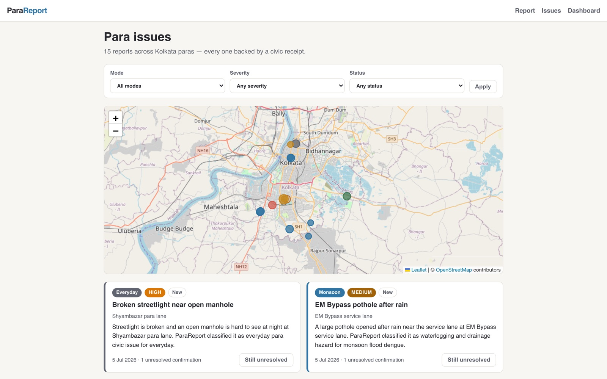

# ParaReport

ParaReport is a Kolkata-first civic intelligence app. It turns citizen photos and
local-language reports into verified civic receipts, department-ready complaint
packets, and para-level civic memory.

Every report is persisted, auto-clustered with earlier reports from the same
location, and gets a shareable public receipt page. Eight seasonal modes cover
the whole Kolkata year: Monsoon Flood and Dengue, Pujo Safety, Summer Heat and
Water, Winter Air and Dust, Post-Pujo Cleanup, Pre-Monsoon Storm Prep, East
Kolkata Wetlands Watch, and Everyday Para Mode.



## Product loop

1. **Report** (`/`) — text in Bengali/Hindi/English plus an optional photo and
   location. The analyzer classifies mode, severity, risk flags, and departments,
   then generates the civic receipt (citizen actions, volunteer checklist,
   official English complaint, Bengali/Hindi share text).
2. **Persist + cluster** — the report is stored in SQLite and matched against
   existing reports at the same location, building recurring-hotspot memory.
3. **Share** (`/issues/[id]`) — every report has a public receipt URL with OG
   metadata and WhatsApp share actions.
4. **Track** (`/issues`, `/dashboard`) — live feed with map, filters,
   "still unresolved" confirmations, "fixed with proof" photo uploads, and a
   ward dashboard computed entirely from real report data.

## Stack

- Next.js (App Router) + TypeScript + React 19
- SQLite via Node's built-in `node:sqlite` (Node 22.13+ required; no native deps).
  DB file lives at `data/parareport.db`, auto-migrated and seeded on first run.
- Leaflet + OpenStreetMap tiles for the issue map
- Local Gemma via llama.cpp for analysis, with a deterministic offline rules
  engine as fallback — the app is fully functional when Gemma is not running

## Run it

Needs Node 22.13+ (for `node:sqlite`).

```bash
npm install
npm run dev
```

Open http://localhost:3000. Tested on macOS (Apple Silicon) with Node 24: the
35 unit and integration tests, typecheck, lint, and production build all pass. The database seeds itself with 15 sample Kolkata
issues on first run; delete `data/` to reset.

### Enable Gemma analysis (optional)

The serve script calls `llama-server` from llama.cpp. On macOS,
`brew install llama.cpp` provides it with Metal support. Point
`GEMMA_GGUF_PATH` at a Gemma GGUF, for example a `gemma-4-E2B-it` quant
downloaded from Hugging Face.

```bash
# Terminal 1
npm run gemma:serve

# Terminal 2
npm run dev
```

The Gemma script uses the GGUF specified by `GEMMA_GGUF_PATH` and exposes an
OpenAI-compatible local endpoint at `http://127.0.0.1:8081/v1`. It starts Gemma
with reasoning disabled so the app receives plain JSON:

```bash
GEMMA_GGUF_PATH=/path/to/model.gguf GEMMA_PORT=8082 GEMMA_MODEL=my-alias npm run gemma:serve
GEMMA_BASE_URL=http://127.0.0.1:8082/v1 GEMMA_MODEL=my-alias npm run dev
```

With the local server running, reports are analyzed by Gemma; every stored issue
records which engine produced its analysis
(`analysisEngine: "local-gemma" | "byok" | "rules"`). Malformed model output or an
unavailable local server falls back to the rules engine per field, so the receipt
schema is always valid. Photo uploads are still stored and attached to receipts,
but this GGUF path analyzes the text/location and attachment hint rather than
image pixels.

### Bring your own model (BYOK)

Hosted deployments let each visitor point ParaReport at any OpenAI-compatible
endpoint. In the report form, open **Bring your own model** and enter a base URL,
model name, and API key. The key is held only in that browser tab's
`sessionStorage` and sent only on the analysis request via headers
(`x-parareport-model-base-url`, `x-parareport-model`, `x-parareport-api-key`); it
is never written to the database, logs, or federation payloads. If a BYOK call
fails, analysis falls back to the deterministic rules engine (not local Gemma).

### Storage backend

The persistence layer sits behind an adapter (`lib/storage/`). The default
`PARAREPORT_STORAGE=local` uses SQLite; `PARAREPORT_STORAGE=hosted` selects an
external Postgres-compatible backend (interface defined, concrete driver not yet
wired).

### Federation (decentralized network)

Independent ParaReport nodes can sync signed civic receipts with trusted peers,
so no single server owns the network. Configure a node with:

```bash
PARAREPORT_NODE_ID=node-kolkata-a          # stable identity, used for provenance
PARAREPORT_NODE_SECRET=shared-secret       # HMAC signing/verify key shared by the trusted mesh
PARAREPORT_PEERS=https://node-b.example,https://node-c.example
```

Receipts are exchanged as signed envelopes (HMAC-SHA256 over canonical JSON);
imports verify the signature, dedupe by origin node + issue id, and are marked
remote-origin. Only the public receipt and structured metadata leave a node —
never raw report text, photos, or BYOK material. Federation API:

| Endpoint | Method | Purpose |
| --- | --- | --- |
| `/api/federation/receipts?since=<cursor>` | GET | Signed feed of local receipts after a cursor |
| `/api/federation/receipts` | POST | Accept a batch of signed envelopes pushed by a peer |
| `/api/federation/sync` | POST | Pull from configured peers (tolerant of offline peers; resumes from cursors) |
| `/api/federation/status` | GET | Node id, signing status, local/remote receipt counts, peers |

### Unit and integration tests

```bash
npm test
```

Runs the `node:test` suites in `tests/` (provider selection/fallback, BYOK
request construction, storage adapter contract + legacy-DB migration, and
signature create/verify/dedupe/tamper plus federation round-trip).

The local Gemma prompt is assembled from editable Markdown files in
`prompts/gemma-local/`: `SYSTEM.md`, `SKILL.md`, `MEMORY.md`, and `SOUL.md`.
Run the multilingual prompt check while `npm run gemma:serve` is running:

```bash
npm run gemma:test
```

For an app-level smoke test against a running Next server, set
`PARAREPORT_BASE_URL` if needed and run:

```bash
npm run reports:test
```

## API

| Endpoint | Method | Purpose |
| --- | --- | --- |
| `/api/reports` | POST | Submit report (JSON or multipart with `photo`) |
| `/api/reports` | GET | List issues (`mode`, `severity`, `status`, `groupId` filters) |
| `/api/reports/[id]` | GET | Issue + cluster summary |
| `/api/reports/[id]/confirm` | POST | Resident confirms still unresolved |
| `/api/reports/[id]/resolve` | POST | Mark fixed (optional multipart `proof` photo) |

## Deployment notes

The app runs in two modes. As a **local node** it is a single Node server
(SQLite file + local photo uploads), so deploy it anywhere with a persistent
disk: Fly.io, Railway, Render, or a VPS. **Hosted mode** (`PARAREPORT_STORAGE=hosted`,
e.g. on Vercel) is designed for external Postgres-compatible storage plus
object storage, but the concrete driver isn't wired yet; the adapter interface
lives in `lib/storage/` and the photo layer in `lib/uploads.ts`. Either mode can join a federation of trusted nodes.

ParaReport generates department-ready civic packets. It does not submit to KMC
systems and never claims official complaint status.
